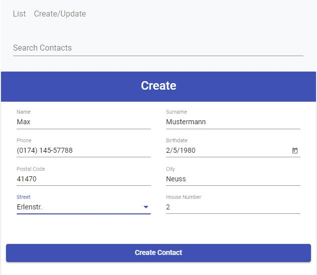
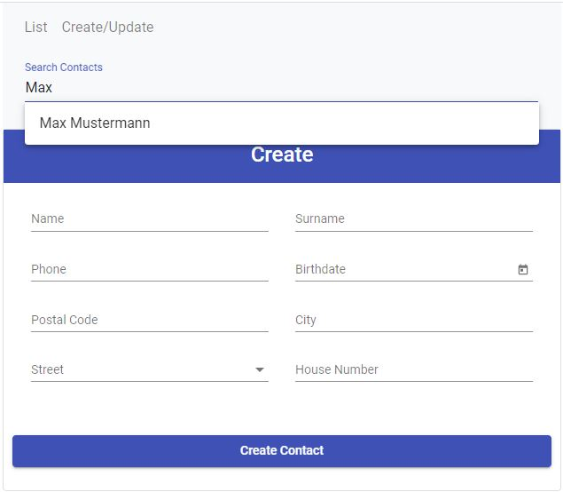
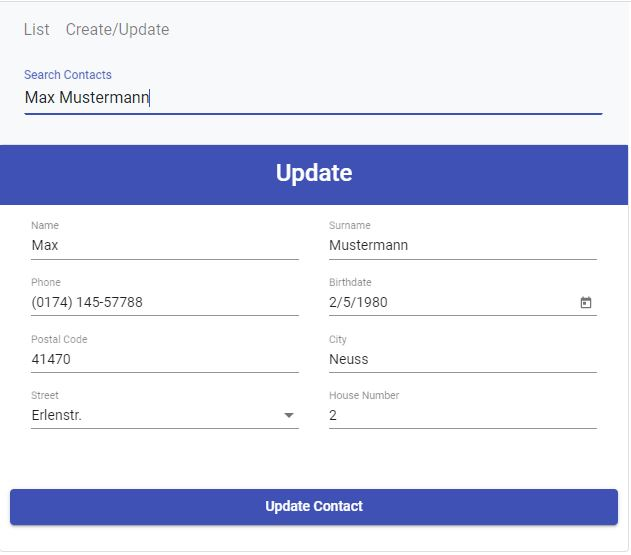
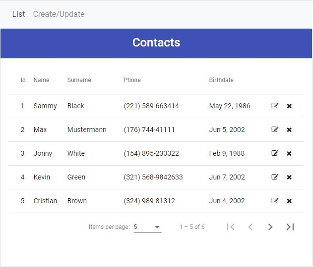

# 1. Frontend

The frontend project was generated with [Angular CLI](https://github.com/angular/angular-cli) version 8.1.3.
#### Start
```
npm install
```

```
npm start
```

##### Create Contact


##### Search Contacts


##### Update Contacts


##### List


# 2. Backend

Backend project was with created with Node.js, Express, Sequelize & MySQL

There is a fake place api in Backend to search cities by postal code and to search streets by portal code and city. You should use the postal codes 41470, 50823 and 50733 to get the streets.

##### Service API

|  Methods |  Urls  | Actions  |
| ------------ | ------------ | ------------ |
| POST | /api/contacts/create | Create a contact |
| GET | /api/contacts/list/:offset/:limit | Get all contacts by limit and offset |
| GET | /api/contacts/count | Get contact count |
| GET | /api/contacts/name/:name | Get contacts by name/surname |
| GET | /api/contacts/:id | Get contact by id |
| POST | /api/contacts/update/:id | Update a contact by id |
| DELETE | /api/contacts/:id | Delete a contact by id |
| DELETE | /api/contacts/:id | Delete a contact by id |
| DELETE | /api/contacts/:id | Delete a contact by id |
| GET | /api/cities/:postalCode | Get cities by postal code |
| GET | /api/streets/:postalCode/:city | Get streets by postal code and city |

#### Database configuration

app/config/db.config.js

```
module.exports = {
  HOST: "localhost",
  USER: "username",
  PASSWORD: "password",
  DB: "dbname",
  dialect: "mysql",
  pool: {
    max: 5,
    min: 0,
    acquire: 30000,
    idle: 10000
  }
};
```


#### Start the Server
```
node server.js
```
